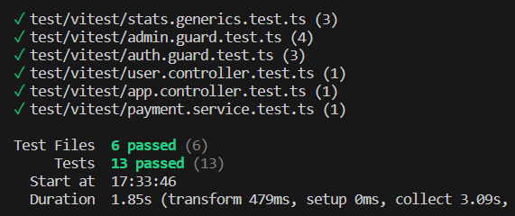
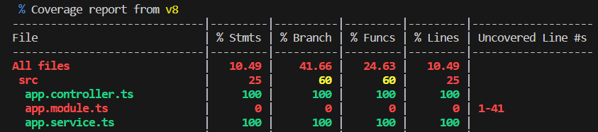
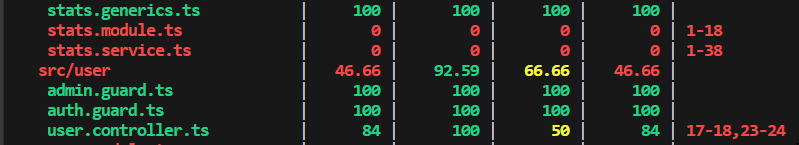

## Overview
 This is an backend project, featuring implemented Vitest unit tests. 
 The purpose of this lab is to familiarize with [Vitest](https://vitest.dev/) unit tests.


## Installation

```bash
$ npm install
# vitest install cmd
$ npm install -D vitest
```

## Running the app

```bash
# development
$ npm run start

# watch mode
$ npm run start:dev

# production mode
$ npm run start:prod
```

## Test  with vitest

```bash
# unit tests
$ npm run test
```


```bash
# test coverage
$ npm run test:coverage
```



